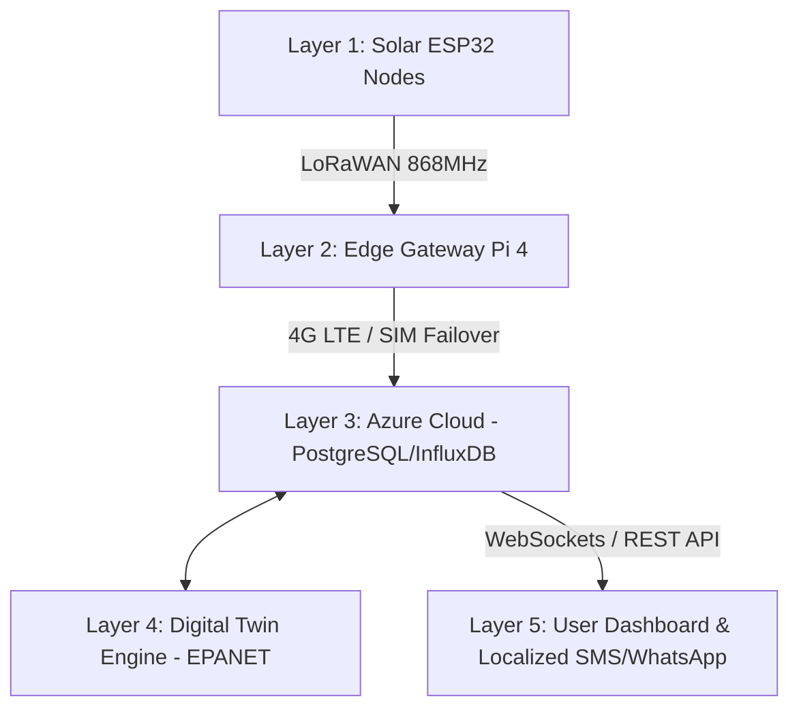

# AquaMirror | FETICON 2026 Project Defense & Technical Guide

This document serves as a comprehensive technical guide and defense handbook for the **AquaMirror Digital Twin Smart Water Network**. Use this guide to present, explain, and defend the project's engineering design, architectural decisions, and localized user experience choices during the **FETICON 2026 Innovation Challenge**.

---

## 1. Executive Summary & Core Value Proposition

**AquaMirror** is a real-time Digital Twin water management platform designed specifically for university campuses in low-resource, high-disruption environments (such as Nigeria). 
- **The Problem:** Campus water networks suffer from high water loss (25–40% Non-Revenue Water) due to aging galvanized and uPVC pipe leaks, unmetered illegal bypasses, and erratic pump cycles caused by unreliable grid power.
- **The Solution:** AquaMirror deploys clamp-on flow, pressure, and acoustic sensors; translates telemetry via ruggedized edge gateways; and mirrors the network using an EPANET-based hydraulic engine to enable automated diagnostics and optimized pumping.
- **The Impact:** Reduces water wastage by up to 35%, lowers reactive maintenance costs by 50%, and pays back its initial capital investment within 18–24 months.

---

## 2. Technical Architecture: How the System Survives Nigeria

Unlike standard "smart-city" setups that fail during power outages or internet drops, AquaMirror is built for **graceful degradation** across five distinct layers:

1. **Layer 1: Physical Sensing Infrastructure:**
   - **Hardware:** Microcontroller units (ESP32-S3) powered by small 10W solar panels and LiPo batteries (72-hour autonomy).
   - **Sensors:** Non-invasive ultrasonic flow clamp-ons, pressure transducers, and acoustic contact microphones to detect leaks on buried pipes.
2. **Layer 2: Edge Gateways (Raspberry Pi 4):**
   - Housed in IP65-rated enclosures to withstand temperatures up to 42°C.
   - Communicates with nodes via low-power **LoRaWAN (868 MHz)** (2km penetration).
   - Buffers up to 7 days of telemetry on local SD cards during network outages and auto-syncs to the cloud when connections restore.
3. **Layer 3: Cloud Data Platform:**
   - Microsoft Azure (Lagos North data center) for low latency and data sovereignty. PostgreSQL for assets/maintenance; InfluxDB for time-series flow rates.
4. **Layer 4: Digital Twin Engine:**
   - Powered by **EPANET 2.2**, calibrating hydraulic flows and pressures in real time. Anomalies exceeding $2\sigma$ from predicted hydraulic states trigger immediate alarms.
5. **Layer 5: Accessible User Dashboard:**
   - Progressive Web App (PWA) designed to load over weak 3G connections. Includes WhatsApp notifications and **Yoruba localization** to ensure accessibility for local municipal crews.

---

## 3. Explaining & Defending the 5 Simulated Fault Scenarios

During your defense, you can trigger these faults in the dashboard and explain the underlying engineering logic:

### Scenario A: Pipe Burst (Hostel Zone DMA-1)
* **What happens:** The flow sensor at the Hostel Zone inlet registers a sudden surge (230 L/min) while the pressure transducer drops. Acoustic correlators flag a high-frequency vibration peak.
* **The Twin's Isolation:** Instantly locates the segment, flags the alarm, and guides the technician to isolate **Valve 12 (V-12)** (located 15m North of the Main Gate) to stop water loss.

### Scenario B: Pump Overheat (Borehole Well BH-1)
* **What happens:** A thermal sensor inside the borehole sub-surface motor registers a temperature spike at 78°C (thermal threshold: 70°C).
* **The Twin's Isolation:** Shut down BH-1 automatically to prevent motor stator burnout, and commands the automatic starter to spin up the standby pump, **Borehole Well 2 (BH-2)**, maintaining campus supply.

### Scenario C: Tank Overflow (Overhead Tank OST-1)
* **What happens:** The overhead storage tank's float sensor hits 99% level, but the inlet Valve 3 (V-3) reports it is still open due to mechanical jamming.
* **The Twin's Isolation:** Flags a control loop mismatch and triggers an emergency alert for manual override at the physical valve box.

### Scenario D: Water Quality - Low Chlorine (Staff Quarters DMA-3)
* **What happens:** In-line chlorine residual sensors drop to 0.05 mg/L (safety threshold: 0.20 mg/L) in the Staff Quarters quadrant.
* **The Twin's Isolation:** Triggers warning to increase dosing pump stroke speed by 15% at the central Water Treatment Unit to avoid biofilm or bacterial outbreak.

### Scenario E: Illegal Water Tapping (Academic Zone DMA-2)
* **What happens:** Mass flow balance checks show that the water volume flowing into DMA-2 exceeds the sum of metered discharge points by 15 L/min (33.3% divergence).
* **The Twin's Isolation:** Identifies the divergence as an unmetered water loss/illegal bypass, initiating security audits behind the Engineering Labs.

---

## 4. Defending Specific UI/UX Design Decisions

The panel may ask about the styling choices of the dashboard. Here are the professional design defenses:

### Q1: Why is the dashboard white (light mode) with flat, solid colors?
> **Defense:** Field operating conditions dictate color schemas. AquaMirror is designed to be used on-site by utility operators using tablets or smartphones in direct sunlight. Dark mode screens are highly reflective in bright daylight, causing glare and eye strain. A flat, solid-white theme provides the maximum possible contrast and readability under harsh, high-lux outdoor environments.

### Q2: Why are there no gradients, shadows, or visual animations on charts?
> **Defense:** Performance and latency. Campus utility personnel often operate low-tier Android tablets or older mobile devices. Eliminating complex CSS gradients, heavy box shadows, and CPU-intensive SVG filter animations guarantees high frame rates, fast dashboard load times, and low battery consumption on field devices.

### Q3: Why did you expand all abbreviations (like DMA, BH, GST, OST)?
> **Defense:** Operational inclusivity. Water networks are maintained by a diverse workforce, including plumbers, security guards, administrators, and engineers. Relying on raw acronyms like "GST-1 to OST-1 flow at DMA 3" creates communication barriers during emergencies. Expanding these to **"Ground Tank (GST-1) to Overhead Tank (OST-1) flow at Staff Quarters (DMA-3)"** ensures that any dispatch operator or security officer can instantly coordinate the correct response.

### Q4: Why provide a Yoruba (Ìyá Mímọ́ Wọta) translation tab?
> **Defense:** Campus operational staff and municipal technicians are often local operators who communicate more effectively in localized terms. Providing a clear, quick translation of mechanical action steps ensures zero ambiguity during high-stress operations like pipe bursts or pump shutdowns.

### Q5: Why is there a "Load Hydraulic Schema (.inp / .json)" button?
> **Defense:** A digital twin is only as accurate as its underlying hydraulic schematic. The "Load Hydraulic Schema" button allows operators to upload new EPANET (.inp) network definition files or JSON telemetry maps directly into the dashboard. During presentations or network refactoring, this button demonstrates the system's ability to dynamic-reload and re-render new campus pipeline networks on the fly.

---

## 5. Pump Schedule Optimization: Linear Programming (LP) Model
* ** Tariff-Aware Pumping:** Pumping water is highly energy-intensive. AquaMirror integrates an optimization engine simulated on **Google OR-Tools** which inputs real-time electricity tariff schedules (peak vs. off-peak hours) and solar PV yield.
* **LP Formulation:** The objective function minimizes energy costs ($₦/kWh$) and carbon footprint, subject to constraints (maintaining minimum tank levels, meeting consumer demands, and limiting pump runtime to prevent overheating).
* **Outcome:** The model calculates peak pumping times (e.g., maximizing borehole pumping during off-peak night hours and solar peak hours) to achieve a **15–20% reduction in daily energy costs**.
